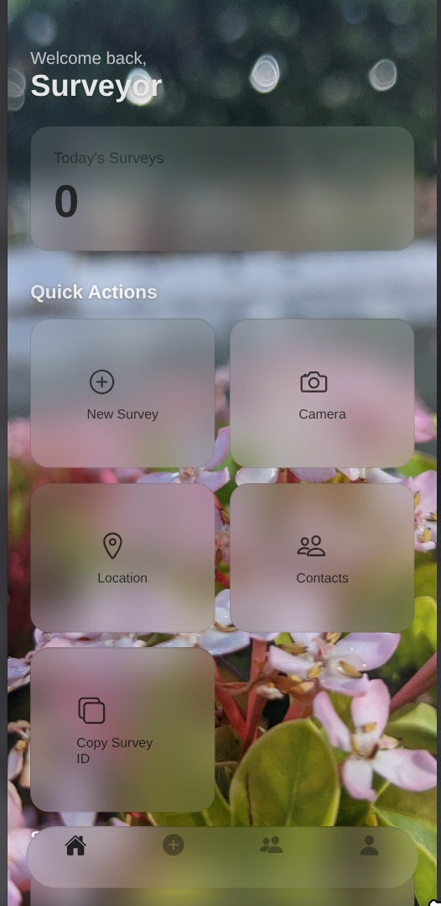

# Smart Survey

A cross-platform React Native application built with Expo, featuring a modern Monochrome Glassmorphism design system. 

## Features

- Edge-to-edge UI with a global background
- Floating bottom navigation bar
- Native frosted glass effects on iOS and Android
- Seamless CSS backdrop-filter fallbacks for web browsers
- Address book integration for contacts
- Native clipboard interactions

## Technical Implementation

### Glassmorphism

Achieving true frosted glass across all platforms required specific tuning:

- iOS uses standard Expo BlurView behavior.
- Android uses the experimental Dimezis BlurView for native rendering instead of the default semi-transparent overlay.
- Web uses CSS `backdrop-filter: blur()` and a fallback background, as rendering the image background on web breaks the compositing required for the effect.

### Dependencies

- expo-router: File-based routing
- expo-blur: For the frosted glass UI elements
- expo-contacts: Local address book access
- expo-clipboard: Copy and paste functionality

## References

- [Dimezis BlurView GitHub Repository](https://github.com/Dimezis/BlurView)
- [Expo BlurView Documentation](https://docs.expo.dev/versions/v54.0.0/sdk/blur-view/)
